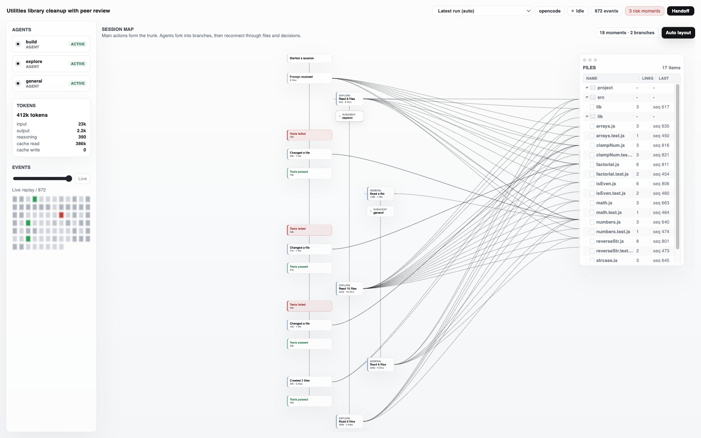
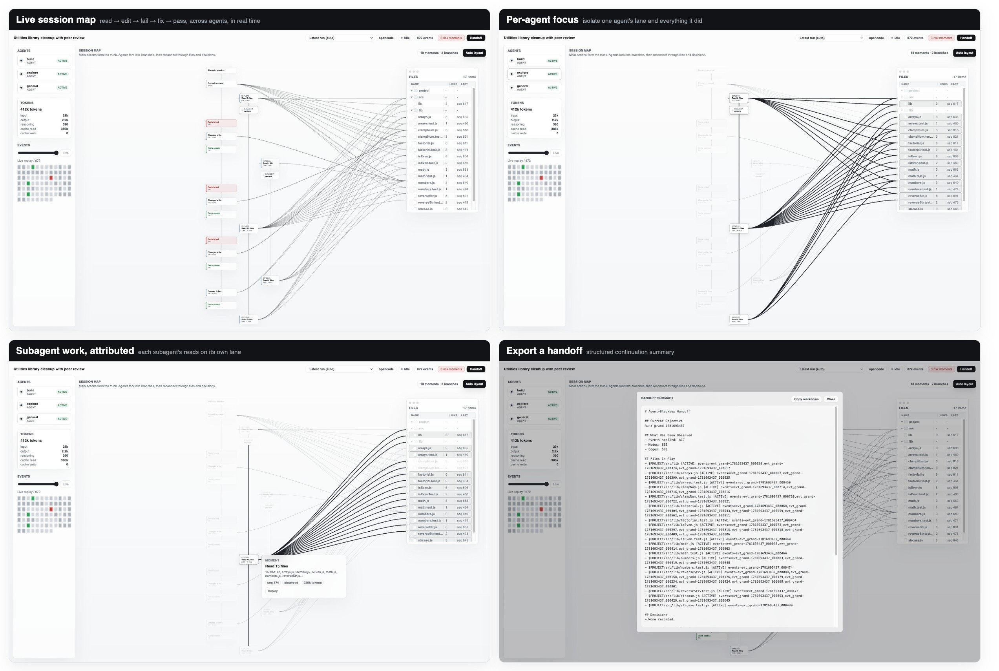
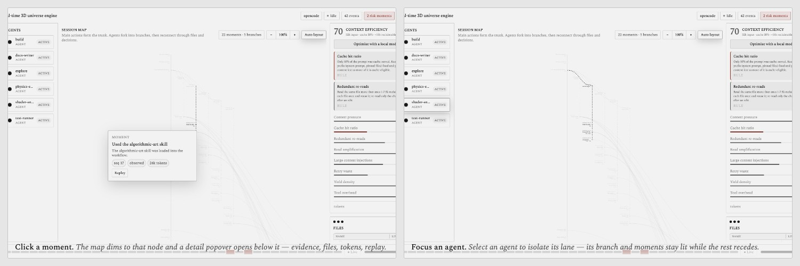
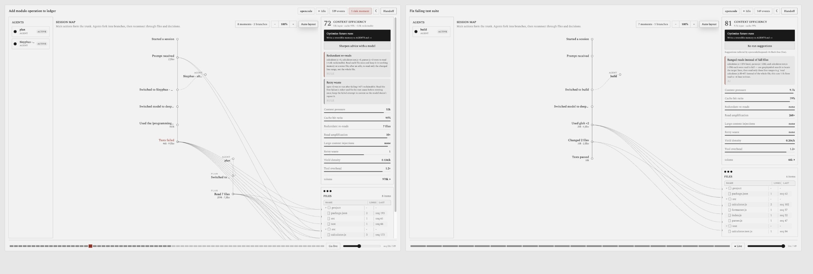
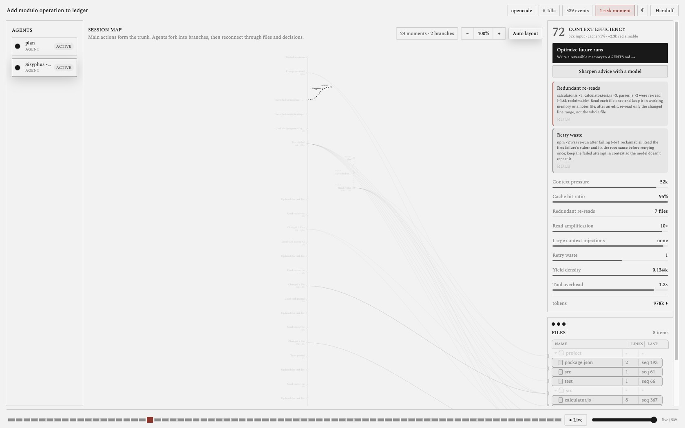
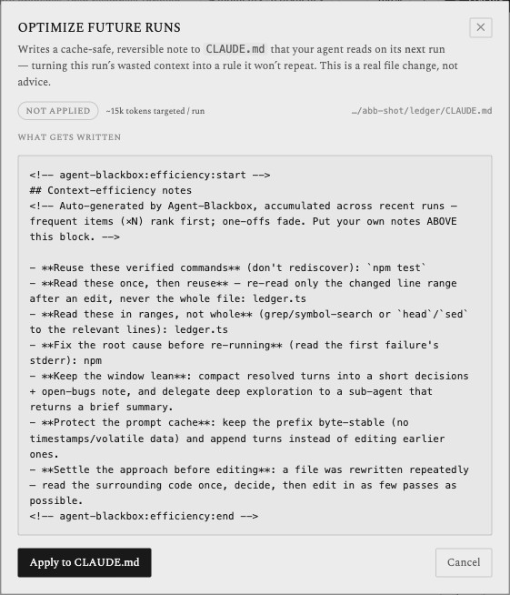
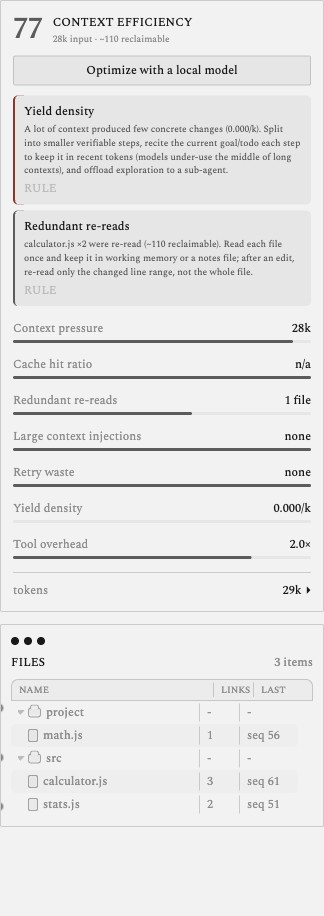
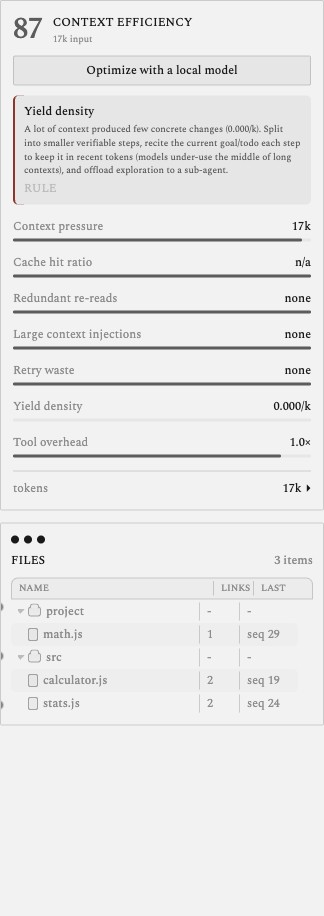
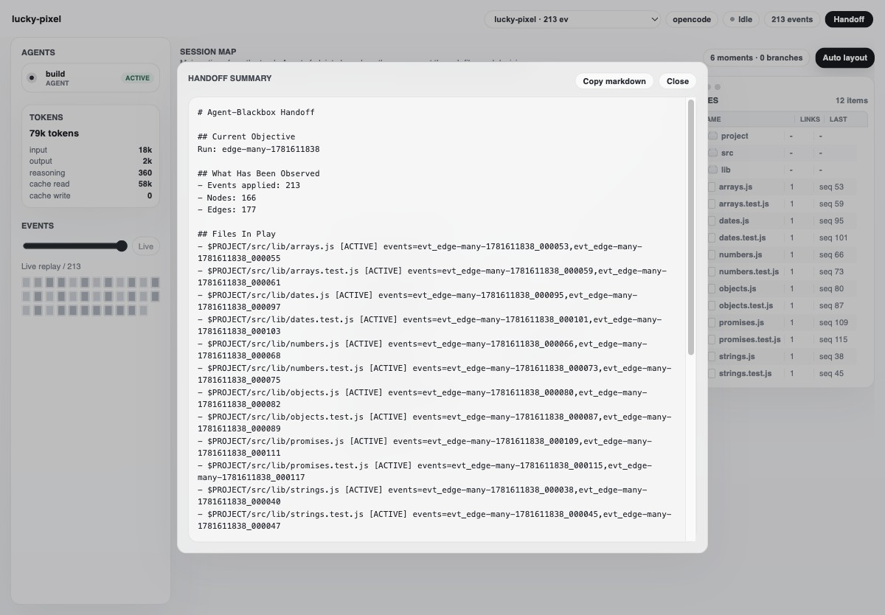

# Agent-Blackbox

**코딩 에이전트의 블랙박스 — 무엇을 했고, 얼마나 태웠고, 어떻게 줄일지 한 화면에서.**

<p align="center">
  <a href="./README.md">English</a> ·
  <b>한국어</b> ·
  <a href="./README.zh.md">中文</a> ·
  <a href="./README.ja.md">日本語</a>
</p>

<p align="center">
  
  
  &nbsp;
  
  
  
  &nbsp;
  
  
  
</p>

Agent-Blackbox는 **코딩 에이전트를 위한 로컬 우선(local-first) 플라이트 레코더이자 컨텍스트 효율 프로파일러**입니다. 에이전트가 무엇을 읽고 바꾸고 실행하고 위임했는지, 어디서 막혔는지를 에이전트 자신의 요약이 아니라 **실제로 관측된 이벤트**로 재구성합니다. 그렇게 실시간으로 보고 되감아 볼 수 있는 작업 그래프가 펼쳐집니다. 그리고 그 실행이 컨텍스트를 얼마나 아껴 썼는지 점수로 매긴 뒤, **거기서 멈추지 않습니다** — 짚어낸 낭비를 **`AGENTS.md`에 직접 고쳐 써넣어**, 실제 OMO 헤비 런에서 효율 점수를 **80 → 99로 끌어올리고 토큰을 44% 줄였습니다.** 전부 로컬에서, **API 키 없이 `npx` 한 줄로.**

> *"트랜스크립트는 에이전트가 한 *말*이고, 블랙박스는 에이전트가 한 *일* — 그리고 그 *비용*이다."*

[**taewoopark.com** — 제작자 사이트](https://taewoopark.com)

<p align="center">
  
</p>

---

## 왜 Agent-Blackbox인가

에이전트에게 "이 작업 얼마 썼어?"라고 **물어선** 안 됩니다. 2026년 프런티어 모델 8종을 에이전틱 코딩(SWE-bench Verified)에서 분석한 연구에 따르면, 모델이 자기 토큰 사용량을 예측하는 정확도는 상관계수 **0.39에 불과**하고 실제 비용을 **체계적으로 과소평가**합니다. 같은 작업·같은 모델인데도 실행마다 토큰이 **최대 30배** 차이 나고, 전문가의 난이도 평가도 실제 비용과 거의 들어맞지 않습니다. 게다가 에이전틱 실행은 이미 일반 코딩보다 **~1000배 많은 토큰**을 태우며, 대부분이 *입력* 컨텍스트입니다.

> 그러니 묻지 말고 — **재세요.** Agent-Blackbox는 모든 실행을 관측된 세션 맵으로 재구성하고, 비용을 정확히 점수로 매긴 뒤, 고쳐서 되돌려줍니다.

<sub>Bai et al., *How Do AI Agents Spend Your Money? Analyzing and Predicting Token Consumption in Agentic Coding Tasks*, [arXiv:2604.22750](https://arxiv.org/abs/2604.22750) (2026).</sub>

---

## 빠른 시작

**한 줄로 — 모든 OpenCode 세션을 기록** (Node 20+ 와 [OpenCode](https://opencode.ai) 필요):

```bash
npx @taewooopark/agent-blackbox up
```

이 명령이 레코더를 OpenCode의 **글로벌** 플러그인 폴더(`~/.config/opencode/plugins/`)에 설치하고, 데몬을 시작하고, **대시보드를 엽니다**(`http://127.0.0.1:5173/`; `--no-open`으로 끄기). 이제 평소 쓰던 그대로 OpenCode를 켜면 맵이 실시간으로 채워집니다:

```bash
opencode          # 아무 폴더에서 (터미널)
# …또는 OpenCode 데스크톱 앱에서 아무 프로젝트나 열기
```

프로젝트별 설정도, `--dir`도, 환경변수도 필요 없습니다 — 어느 세션·어느 폴더든, 앱까지. 기록을 멈추려면 `npx @taewooopark/agent-blackbox uninstall`.

<details>
<summary><b>한 프로젝트로만 한정하거나, 소스에서 실행</b></summary>

```bash
# 한 프로젝트만 기록 (레코더가 글로벌 대신 <dir>/.opencode 에 설치됨)
npx @taewooopark/agent-blackbox up --project /path/to/your/project

# 소스에서 (개발/기여용)
git clone https://github.com/TaewoooPark/Agent-Blackbox
cd Agent-Blackbox && npm install && npm run build:cli
node packages/cli/dist/cli.js up
```
</details>

맵이 실시간으로 조립됩니다. 끝.

### 레시피

```bash
# 그냥 관찰 — 한 번 켜두고 OpenCode를 아무 데서나 사용 (터미널이든 앱이든)
npx @taewooopark/agent-blackbox up
opencode   # 아무 폴더에서; 대시보드가 실시간으로 채워짐

# 최적화 — 무료/로컬 모델로 맞춤 수정안을 받아 우측 레일에서 확인
npx @taewooopark/agent-blackbox up --suggest ollama --suggest-model qwen2.5-coder

# 멀티 에이전트 — 평소 세션에서 위임하면 각 서브에이전트가 자기 레인으로 분기
opencode "탐색·구현·테스트를 서브에이전트에 위임한 뒤 요약해줘."

# 이어가기 — 실행을 열고 Handoff 클릭, Markdown을 다음 세션에 붙여넣기

# 포트 변경 (47831/5173이 점유된 경우 — 레코더가 자동으로 맞춰 재스탬프됨)
npx @taewooopark/agent-blackbox up --port 48000 --ui-port 4000

# 기록 중지 (글로벌 레코더 제거)
npx @taewooopark/agent-blackbox uninstall
```

---

## 한 번에 세 가지

**1 · 에이전트가 실제로 한 일을 본다.** 코딩 에이전트는 파일 수십 개를 읽고, 명령을 돌리고, 코드를 고치고, 서브에이전트를 띄운 뒤 깔끔한 요약을 건넵니다. 정작 당신 손에 쥐어지는 건 끝없이 스크롤되는 트랜스크립트와, 믿을 수밖에 없는 그 요약뿐입니다. Agent-Blackbox는 이것을 한눈에 읽히는 **세션 맵**으로 바꿉니다.

**2 · 그 비용을 잰다.** 컨텍스트는 곧 돈이고 지연이며 넘을 수 없는 윈도 한계입니다. Agent-Blackbox는 각 실행이 컨텍스트를 얼마나 알뜰하게 썼는지(캐시 재사용, 중복 재읽기, 읽기-수정 증폭, 거대 도구 출력, 재시도 낭비) 점수로 매기고 **구체적인 최적화**를 짚어 줍니다. 규칙으로 잡아내거나, **API 키 없이 도는 무료 로컬 모델**이 직접 써 내려갑니다.

**3 · 그리고 고친다.** 낭비를 보여주는 데서 멈추는 도구는 많습니다. Agent-Blackbox는 짚어낸 낭비를 프로젝트 **`AGENTS.md`에 되돌려 써넣어**, 다음 실행이 같은 실수를 반복하지 않게 합니다. 대시보드의 *Optimize future runs* 버튼 한 번이면 되고, 언제든 되돌릴 수 있습니다. 조언이 아니라 실제로 파일에 적용되는, 그러면서 되돌릴 수 있는 변경입니다.

| 트랜스크립트 읽기 | Agent-Blackbox |
|---|---|
| 선형 로그 스크롤 | 한눈에 읽는 **세션 맵** |
| 에이전트 요약을 믿음 | **관측 이벤트**로 재구성 |
| "테스트 통과했어요" | **실패 → 수정 → 통과** 루프를 직접 봄 |
| 긴 실행에서 길을 잃음 | 어느 순간이든 **스크럽·리플레이** |
| 불투명한 한 덩어리 | **서브에이전트 계보** — 누가 무엇을 위임했나 |
| 비용을 알 수 없음 | **컨텍스트 효율 점수** + 회수 가능 토큰 |
| "왜 이렇게 비싸지?" | **구체적 수정안**, 원하면 로컬 모델이 작성 |
| 이어가려면 전부 다시 읽음 | 원클릭 **핸드오프** 요약 |
| 코드·프롬프트가 머신을 떠남 | **로컬 우선**, 최소 캡처, **API 키 불필요** |

---

## 실시간으로 펼쳐지는 화면

맵은 사후 부검이 아닙니다. **에이전트가 일하는 동안** 만들어집니다: 레코더가 이벤트를 로컬 데몬으로 스트리밍하고, 대시보드가 WebSocket으로 갱신됩니다 — 모먼트가 나타나고, 휘어지는 아크로 파일이 연결되고, 토큰이 올라가고, 실패한 테스트가 옥스블러드로 표시되며, 수정이 그것을 해소합니다. 새로고침도 리플레이도 필요 없습니다.

그게 핵심입니다: **비행이 끝나기 전에 블랙박스를 연다.**

---

## 제공 기능

- **실시간 세션 맵** — 의미 있는 모먼트의 척추로 실시간 형성. 연속 반복은 집계(`Created 12 files`, `Tests passed ×6`)되어 큰 실행도 스캔 가능.
- **내러티브 구조 미학** — 평평한 모노크롬 "Mark Lombardi" 다이어그램: 속 빈 링 노드, 휘어지는 링-투-링 아크, 세리프 라벨. 종이 위 그라파이트(라이트) 또는 잉크 위 실버포인트(다크); 유일한 색은 **위험/실패 전용 옥스블러드**.
- **리플레이** — 항법도식 타임라인을 어느 지점으로든 끌면 그래프와 파일이 그 시점 상태로.
- **클릭 포커싱** — 모먼트 선택 시 상세 팝오버(증거·파일·토큰), 에이전트 선택 시 해당 레인만 분리, 파일 클릭 시 그 파일을 건드린 모든 모먼트가 각 노드의 링에서 뻗는 아크로 강조.
- **서브에이전트 계보** — 실제 위임(`task` 도구 / 자식 세션)이 자기 분기로 갈라지고, 일을 한 서브에이전트에 귀속.
- **컨텍스트 효율** — 실시간 점수 + 지표 미터(컨텍스트 압력, 캐시 적중, 중복 읽기, 읽기 증폭, 거대 주입, 재시도 낭비, 산출 밀도)와 원탭 최적화 노테이션 — **규칙 기반, 또는 무료/로컬 모델 라우팅(API 키 불필요)**.
- **핸드오프 내보내기** — 구조화된 인계 요약(목표·관여 파일·결정·명령·실패·블로커·다음 안전한 행동)을 원클릭으로 Markdown 복사.
- **런 피커** — 한 프로젝트 로그에 여러 실행, 콘솔은 가장 최근 *활성* 실행을 따르고 과거 실행도 고정 가능.
- **전체 이벤트 커버리지** — 어떤 모델을 쓰든 모든 행동(읽기·수정·bash·스킬·커스텀/MCP 도구·권한·todo·서브에이전트)이 호스트 이벤트 기준으로 캡처됨(모델 무관).
- **원커맨드 부트스트랩** — `npm run up` 한 줄로 레코더 플러그인 설치 + 데몬 시작 + 대시보드 서빙.

<p align="center">
  
</p>

<p align="center">
  
</p>

<p align="center">
  
</p>

---

## 컨텍스트 효율 — 스스로 본전을 뽑는 부분

모든 실행은 관측된 크기와 토큰 스냅샷으로 점수를 받습니다 — 에이전트의 자기보고가 아닙니다. 플래그된 지표는 각각 구체적 수정안으로 펼쳐집니다.

| 지표 | 무엇을 잡나 |
|---|---|
| **컨텍스트 압력** | 프롬프트가 최고조에 얼마나 커졌나 |
| **캐시 적중률** | 프롬프트 중 캐시로 제공된 비율 |
| **중복 재읽기** | 같은 파일을 한 번 이상 끌어옴(회수 가능 토큰 포함) |
| **읽기 증폭** | 수정한 양보다 훨씬 많이 읽음 — 파일 말고 구간만 |
| **거대 주입** | 단일 도구 출력이 윈도를 침수 |
| **재시도 낭비** | 원인 수정 전에 실패 명령을 재실행 |
| **산출 밀도** | 1k 토큰당 만든 구체적 변경량 |

제안은 **기본 규칙 기반**(항상 동작, 의존성 없음). 모델이 맞춤 작성하게 하려면 — **API 키 없이** — `up`을 로컬/무료 모델로 가리키면 됩니다:

```bash
# Ollama (권장): 로컬, 키 불필요
npx @taewooopark/agent-blackbox up --suggest ollama --suggest-model qwen2.5-coder

# OpenAI 호환 localhost 서버 (LM Studio, llama.cpp)
npx @taewooopark/agent-blackbox up --suggest openai-compat --suggest-base-url http://127.0.0.1:1234

# 설치된 바이너리로 OpenCode 무료 모델 재사용
npx @taewooopark/agent-blackbox up --suggest opencode --suggest-model opencode/deepseek-v4-flash-free
```

`--suggest auto`(기본)는 위 순서로 탐지 후 규칙 기반으로 폴백합니다. 로컬 모델에도 **redact된 파생 다이제스트**만 전송됩니다: 지표 상태·횟수·크기, 그리고 거친 **가해자 라벨 — 파일 basename과 명령 verb**(예: `billing.ts ×2`, `deploy ×2` — 무엇을 고칠지 짚기 위함) — 하지만 **파일 내용·디렉터리 경로·명령 인자·프롬프트·비밀은 절대 보내지 않습니다**.

### 조언의 근거 자료

제안은 일반적인 팁이 아닙니다. 항상 켜진 규칙 기반 floor와 로컬 모델 프롬프트 모두 지표별 **수정 플레이북**을 내장하며, 모든 조언은 이 실행의 실제 숫자를 인용하고, 문제된 파일/명령을 지목하고, 구체적 메커니즘과 기대 효과를 명시하도록 강제됩니다. 플레이북은 다음의 컨텍스트 엔지니어링 연구·프로덕션 사례에서 정제했습니다:

| 자료 | 기여 내용 | 관련 지표 |
|---|---|---|
| Anthropic — [Effective context engineering for AI agents](https://www.anthropic.com/engineering/effective-context-engineering-for-ai-agents) | **컴팩션**(완료된 턴을 요약 → 새 윈도 시작), 이미 처리한 도구 출력 비우기, **서브에이전트 컨텍스트 격리**(자식에서 탐색 후 ~1–2k 토큰 요약만 반환), **just-in-time 검색**(grep/glob로 필요할 때 읽기, 전체 파일 사전 로드 지양) | `context-pressure`, `read-amplification`, `redundant-reads`, `yield-density` |
| Manus — [Context Engineering for AI Agents: Lessons from Building Manus](https://manus.im/blog/Context-Engineering-for-AI-Agents-Lessons-from-Building-Manus) | **KV-캐시 적중률**이 핵심 비용 레버(캐시 토큰 ≈ 10× 저렴), byte-stable 프롬프트 프리픽스(타임스탬프·휘발 데이터 금지), append-only 컨텍스트, 툴 추가/제거 대신 마스킹, 파일시스템을 외부 메모리로, 매 스텝 목표 **recitation** | `cache-hit`, `large-injections`, `retry-waste` |
| Liu 외 — [Lost in the Middle: How Language Models Use Long Contexts](https://arxiv.org/abs/2307.03172) | 모델이 긴 컨텍스트의 **중간을 체계적으로 덜 활용**(U자 정확도, ~30%+ 저하) → "더 넣기"보다 트리밍/재배치·목표 recitation을 권고 | `context-pressure`, `yield-density` |
| Anthropic — [Building effective agents](https://www.anthropic.com/engineering/building-effective-agents) | 최소·**비중복 툴셋**과 명확한 툴 경계; 탐색적 호출 체인 대신 관련 동작 배치 | `tool-overhead` |
| Schulhoff 외 — [The Prompt Report: A Systematic Survey of Prompt Engineering Techniques](https://arxiv.org/abs/2406.06608) | 대조 few-shot(나쁜-막연 vs 좋은-구체), 제공된 숫자에 근거, 엄격한 구조화 출력 — 작은 로컬 모델도 구체적이고 실행 가능한 JSON을 반환 | *(어드바이저 프롬프트 자체를 설계)* |

작은 로컬 모델에서 종단 검증: 중복 읽기 발견이 "파일을 한 번만 읽으세요"에서 **"`calculator.js`가 2회 읽혔습니다(~282 회수 가능) — 한 번만 읽고 캐시한 뒤, 편집 후에는 전체 파일이 아니라 변경된 라인 범위만 다시 읽으세요."** 로 바뀝니다.

---

## oh-my-openagent과 함께 — 무거운 다중 에이전트 실행을 프로파일링하고 줄이기

[**oh-my-openagent (OMO)**](https://github.com/code-yeongyu/oh-my-openagent)는 OpenCode를 다중 에이전트 *tokenmaxxer* 하네스로 바꿉니다 — 11개 전문 에이전트, 병렬 실행, 복잡한 작업을 끝내려 토큰을 적극적으로 쏟아붓는 집요한 루프. Agent-Blackbox는 바로 그 워크로드를 위한 계기판입니다: **OMO가 액셀을 밟고, Agent-Blackbox가 다이노이자 텔레메트리.**

둘 다 OpenCode 플러그인이라 설정 없이 공존합니다 — 레코더가 설치된 상태로 OMO를 돌리면 팀 전체가 나타납니다:

- **팀 전체를 본다.** SDK로 생성된 각 서브에이전트(Sisyphus, explore, librarian, plan, oracle…)가 자기 레인을 갖고, 위임이 트렁크에서 갈라지며, 파일이 곡선으로 연결됩니다. 이 정도 복잡한 실행을 위해 만든 맵입니다.
- **비용을 보고 — 줄인다.** "tokenmaxxer" 실행이야말로 컨텍스트 경제가 가장 중요한 곳입니다. Agent-Blackbox가 점수화하고(컨텍스트 압력, 중복 재읽기, 읽기 증폭, 도구 오버헤드) 정확한 원인을 짚습니다 — 하네스 내부에선 보이지 않는 비용을.
- **루프를 닫는다.** 발견을 `AGENTS.md`에 박아 다음 실행에 반영하고, 인-런 최적화기(`AGENT_BLACKBOX_OPTIMIZE=1`)를 켜 재읽기를 노옵/diff로 제공 — *같은 실행 안에서* 절감, 재실행 없이.

실제 OMO `ultrawork` 실행을 Agent-Blackbox가 실시간 기록한 모습 — 좌측엔 명명된 전문 에이전트 레인, 우측엔 회수 가능 토큰과 맞춤 수정안이 붙은 컨텍스트 효율 점수:

<p align="center">
  
</p>

```bash
# 둘 다 전역 설치 — ABB를 한 번 켜두고 OMO를 평소처럼. :5173에서 확인.
npx @taewooopark/agent-blackbox up --suggest free
opencode "ultrawork: refactor the auth module and add tests"   # OMO + 레코더 동시 작동
```

발견을 손으로 옮길 필요 없이 **대시보드에서 바로** — 우측 패널의 **Optimize future runs** 버튼을 누르면 `AGENTS.md`에 쓰일 블록을 *그대로 미리보기*(재확보 가능 토큰·대상 경로 포함)하고, 한 번의 클릭으로 적용·갱신·되돌리기까지 합니다. 조언이 아니라 실제로 되돌릴 수 있는 파일 변경입니다:

<p align="center">
  
</p>

**실측 — 같은 OMO `ultrawork` 작업의 공정한 전후 비교** (Claude Sonnet, 동일 작업·콜드 세션, `AGENTS.md`만 추가): Run A에서 explore 서브에이전트가 9개 파일을 재읽기 → ABB가 *"이 파일들은 한 번만 읽어라"*를 `AGENTS.md`에 고정 → 같은 작업을 콜드로 다시 돌린 Run B에서 재읽기가 사라짐. 두 실행 모두 동일한 깨끗한 레포(중간에 git reset)와 새 세션에서 시작 — 가져온 맥락 없음.

| | 전 (run A) | 후 (run B) |
|---|---|---|
| 컨텍스트 효율 점수 | 80 | **99** |
| 중복 재읽기 | 9개 파일 (~1.8k 재확보 가능) | **없음** |
| 총 토큰 | 939k | **521k** (−44%) |
| 도구 호출/이벤트 | 619 | **253** |

<table>
<tr>
<td width="50%"></td>
<td width="50%"></td>
</tr>
</table>

> ⚠️ 이 2회 실행 비교는 **메커니즘 검증용 벤치마크**다(같은 작업을 다시 돌리면 토큰을 2배 쓰는 것). 실제로는 한 번 적용하면 그 레포의 *이후 다른* 작업에서 재실행 없이 효과를 본다.

---

## 핸드오프 — 어디서든 이어받기

다른 곳에서 이어가야 할 때 — 팀원, 다음 에이전트, 혹은 컨텍스트 리셋 후 같은 에이전트 — 구조화된 **핸드오프**를 내보내세요:

<p align="center">
  
</p>

---

## 동작 방식

```
 opencode run ──hooks──▶  recorder plugin  ──events──▶   daemon   ──/stream──▶  dashboard
                          redact + normalize            NDJSON 로그           실시간 세션 맵
                          (호스트 어댑터)                + 그래프/리플레이      + 효율
                                                        + 효율 리포트         (이 UI)
```

- **`packages/core`** — 정규 `TraceEvent`, 워크플로 그래프 모델, redaction, 리플레이, audit, 핸드오프 생성, 컨텍스트 효율 엔진.
- **`packages/opencode-adapter`** — 호스트 이벤트와 도구 호출을 정규·redact 이벤트(내용이 아닌 *크기*만 포함)로 바꿔 데몬에 best-effort 전송하는 얇은 OpenCode 플러그인.
- **`apps/daemon`** — 이벤트를 로컬 NDJSON 로그로 적재, 그래프 생성, 임의 지점 리플레이, 효율 리포트 계산, 제안 라우팅, WebSocket 실시간 스냅샷 푸시.
- **`apps/dashboard`** — 오퍼레이터 콘솔: 실시간 세션 맵, 리플레이, 인스펙터, 효율 코파일럿, 핸드오프.

---

## 철학 — 관측하라, 화자를 믿지 마라

> **진실은 관측된 이벤트에서 끌어내라, 자유서술 자기보고가 아니라.**

- **서술이 아니라 행동.** 모든 노드는 에이전트가 실제로 내보낸 이벤트 — 읽기, 수정, 명령과 종료코드, 위임 — 입니다.
- **비용도 증거다.** 효율 점수와 모든 제안은 관측된 크기·토큰 스냅샷에서 나옵니다.
- **로컬 우선, 키 불필요.** 트레이스는 머신에 남습니다. 프롬프트·비밀·파일 내용은 기본적으로 가려지고, 선택적 모델 제안도 로컬에서 돌며 가린 다이제스트만 받습니다.
- **호스트 무관 코어.** 정규 이벤트+그래프 코어에 얇은 어댑터 — 같은 블랙박스가 어떤 하네스 뒤에도. OpenCode가 첫 번째.

---

## 데몬 API

| 메서드 & 경로 | 용도 |
|---|---|
| `POST /events` | 정규 `TraceEvent` 적재 |
| `GET /events` | 영속 이벤트 로그 |
| `GET /graph?seq=<n>` | 시퀀스까지 그래프 리플레이 |
| `GET /snapshot?seq=<n>` | 이벤트·그래프·audit·효율 리포트·핸드오프 |
| `GET /efficiency?seq=<n>` | 컨텍스트 효율 리포트(점수+지표) |
| `POST /suggest` | 게시된 리포트에 대한 최적화 제안(결정론 또는 로컬 모델) |
| `GET /handoff` | 생성된 핸드오프 Markdown |
| `WS /stream` | 적재마다 실시간 스냅샷 푸시 |

---

## 개발

```bash
npm install
npm run check   # 타입체크 + 테스트
npm run build
```

---

## 컨택

<p align="center">
  <a href="https://github.com/TaewoooPark"></a>
  <a href="https://x.com/theoverstrcture"></a>
  <a href="https://www.linkedin.com/in/taewoo-park-427a05352"></a>
  <a href="https://www.instagram.com/t.wo0_x/"></a>
  <a href="https://taewoopark.com"></a>
  <a href="mailto:ptw151125@kaist.ac.kr"></a>
</p>

<p align="center"><sub>로컬 우선. API 키 불필요. 관측하라, 화자를 믿지 마라.</sub></p>
