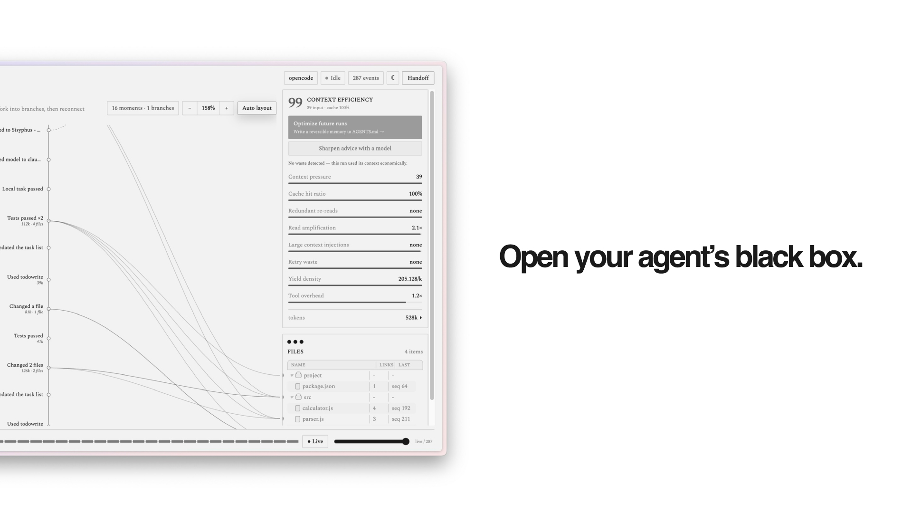

# Agent-Blackbox

**打开你的编码智能体的黑匣子。**

<p align="center">
  <a href="./README.md">English</a> ·
  <a href="./README.ko.md">한국어</a> ·
  <b>中文</b> ·
  <a href="./README.ja.md">日本語</a>
</p>

<p align="center">
  
  
  &nbsp;
  
  
  
  &nbsp;
  
  
  
  
  
</p>

Agent-Blackbox 是一个**面向编码智能体、本地优先（local-first）的飞行记录仪与上下文效率分析器**。它把每一次智能体运行重建为一张**实时、可回放的操作图** —— 读了什么、改了什么、跑了什么、做了什么决定、委派了什么、卡在哪里、验证了什么 —— 全部来自**观测到的事件**，而不是智能体自己的总结。然后它从**两个轴**给运行打分：上下文窗口用得有多经济，*以及*任务是否真的落地；评分会套用**适合任务类型**（research / debug / ops…）和**你自己的历史运行**的尺子，并具体告诉你怎样让下一次更便宜、更快。

**支持 [Claude Code](https://www.claude.com/product/claude-code)、[Codex](https://developers.openai.com/codex/) 与 [OpenCode](https://opencode.ai)** —— 同一个记录器、同一张地图、同一套效率评分。可记录其中一个，也可同时记录全部。

> *"对话记录是智能体所*说*的，黑匣子是它所*做*的 —— 以及它的*代价*。"*

[**taewoopark.com** — 作者站点](https://taewoopark.com)

<p align="center">
  
</p>

---

## 为什么用 Agent-Blackbox

别直接**问**智能体这次花了多少。2026 年一项针对 8 个前沿模型在智能体编码（SWE-bench Verified）上的研究发现：模型预测自己 token 用量的准确度，相关系数仅 **0.39 —— 且系统性地低估**真实账单。同一任务、同一模型，单次运行的 token 可相差 **多达 30 倍**；专家的难度评级也几乎对不上真实成本。何况智能体运行本就比普通编码烧掉 **约 1000 倍** 的 token，且绝大多数是*输入*上下文。

> 所以别问 —— **去测。** Agent-Blackbox 把每次运行重建为可观测的会话地图，精确评分它的成本，再把修复写回去。

<sub>Bai et al., *How Do AI Agents Spend Your Money? Analyzing and Predicting Token Consumption in Agentic Coding Tasks*, [arXiv:2604.22750](https://arxiv.org/abs/2604.22750) (2026).</sub>

<p align="center">
  
</p>

---

## 快速开始

**一条命令 —— 支持 Claude Code、Codex 与 OpenCode**（需要 Node 20+）：

```bash
# 记录 Claude Code —— 无需安装任何东西；守护进程会跟读它本就写出的
# 会话记录（~/.claude/projects/）
npx @taewooopark/agent-blackbox up --host claude-code

# …或记录 Codex（CLI 与桌面应用；无需安装记录器）
npx @taewooopark/agent-blackbox up --host codex

# …或记录 OpenCode（把记录器装进 OpenCode 的全局插件目录）
npx @taewooopark/agent-blackbox up

# …或同时记录两个宿主，汇入同一个仪表盘
npx @taewooopark/agent-blackbox up --host all
```

无论哪种方式，它都会启动守护进程并**打开仪表盘**（`http://127.0.0.1:5173/`；加 `--no-open` 可跳过）。然后照你平时的方式用智能体即可，地图会实时填充：

```bash
claude            # Claude Code，在任意文件夹 —— 零配置，直接运行
opencode          # …或 OpenCode（终端或桌面应用）
```

- **Claude Code 完全无需安装** —— 守护进程会跟读 CLI 本就写出的 JSONL 会话记录，所以任意文件夹、任意会话，在你运行 `claude` 的那一刻就被记录。（加 `--optimize` 可一并安装可选的运行内执行器钩子。）
- **Codex 同样无需安装记录器** —— `--host codex` 会跟读 CLI 与桌面应用的 `$CODEX_HOME/sessions`（默认 `~/.codex/sessions`）。加 `--optimize` 可安装可选执行器，并在 `/hooks` 中信任一次。
- **OpenCode** 通过装入其**全局**插件目录（`~/.config/opencode/plugins/`）的记录器进行记录 —— 任意会话、任意文件夹，连桌面应用也算。
- **Gajae-Code** *(实验性)* —— `--host gjc` 跟读 [Gajae-Code](https://github.com/Yeachan-Heo/gajae-code) 会话（`~/.gjc/agent/sessions/`，无需安装）；`--host all` 亦包含。

随时用 `npx @taewooopark/agent-blackbox uninstall` 停止记录。

<details>
<summary><b>把 OpenCode 限定到单个项目，或从源码运行</b></summary>

```bash
# 只记录一个 OpenCode 项目（记录器装进 <dir>/.opencode，而非全局）
npx @taewooopark/agent-blackbox up --project /path/to/your/project

# 从源码（开发 / 贡献）
git clone https://github.com/TaewoooPark/Agent-Blackbox
cd Agent-Blackbox && npm install && npm run build:cli
node packages/cli/dist/cli.js up --host claude-code   # 或：up | up --host all
```
</details>

图会实时自我组装。就这样。

### 用法示例

```bash
# 只是观察 Claude Code —— 启动一次，然后在任意地方用 `claude`
npx @taewooopark/agent-blackbox up --host claude-code
claude   # 在任意文件夹；仪表盘实时填充

# 同时记录两个宿主，并由免费/本地模型给出定制修复
npx @taewooopark/agent-blackbox up --host all --suggest ollama --suggest-model qwen2.5-coder

# 多智能体 —— 在平常的会话里委派即可，每个子智能体分叉到自己的泳道
claude "把探索、实现、测试委派给子智能体，然后总结。"

# 续接 —— 打开运行，点 Handoff，把 Markdown 粘到下一个会话

# 换端口（若 47831/5173 被占用 —— 记录器会自动重新写入匹配的端口）
npx @taewooopark/agent-blackbox up --host claude-code --port 48000 --ui-port 4000

# 停止记录（移除全局记录器 + 任何 Claude Code 钩子）
npx @taewooopark/agent-blackbox uninstall
```

---

## 一次同时做两件事

**1 · 看见智能体真正做了什么。** 编码智能体读十几个文件、跑命令、改代码、派生子智能体，然后递给你一份漂亮的总结。你唯一的窗口只是滚动的对话记录和一份只能盲信的总结。Agent-Blackbox 用一张一眼可读的**会话图**取而代之。

**2 · 看见并削减它的代价。** 上下文就是金钱、延迟和硬性的窗口上限。Agent-Blackbox 为每次运行的上下文使用效率打分（缓存复用、重复读取、读改放大、超大工具输出、重试浪费），并给出**具体的优化建议** —— 默认基于规则，或由一个**无需 API key 的免费本地模型**量身撰写。

| 读对话记录 | Agent-Blackbox |
|---|---|
| 滚动线性日志 | 一眼可读的**会话图** |
| 盲信智能体总结 | 由**观测事件**重建 |
| "测试通过了" | 亲眼看见**失败 → 修复 → 通过**循环 |
| 长运行中迷失线索 | **拖动回放**任意时刻 |
| 一个不透明的整体 | **子智能体谱系** —— 谁委派了什么 |
| 不知道花了多少 | **上下文效率评分** + 可回收 token |
| "它真的完成了吗？" | 第二个 **outcome** 分数 —— 高效但失败 ≠ 浪费但交付 |
| 每类任务同一把尺 | **任务定制**（research / debug / ops）+ 对比**你自己的历史运行** |
| "为什么这么贵？" | **具体修复**，可由本地模型撰写 |
| 续接需重读全部 | 一键**交接（handoff）**摘要 |
| 代码与提示离开本机 | **本地优先**、最小采集、**无需 API key** |

---

## 实时上演

这张图不是事后尸检。它在**智能体工作时**生成：记录器把事件流式传给本地守护进程，仪表盘通过 WebSocket 更新 —— 时刻出现、文件以弧线相连、token 跳动、失败的测试标为暗红、修复将其化解。无需刷新，无需回放。

这正是核心：**趁飞行尚在空中，打开黑匣子。**

---

## 你将获得

- **实时会话图** —— 以有意义的"时刻脊柱"实时成形；连续重复会聚合（`Created 12 files`、`Tests passed ×6`），即使大型运行也可扫读。
- **叙事结构美学** —— 扁平、单色的 "Mark Lombardi" 图：空心环节点、环到环的扫掠弧线、衬线标签。纸上石墨（浅色）或墨上银尖笔（深色）；唯一的强调色是**仅用于风险/失败的暗红**。
- **回放** —— 拖动导航图式时间轴到任意序列点，图与文件回到该时刻的状态。
- **点击聚焦** —— 选时刻看详情弹窗（证据、文件、token）；选智能体隔离其泳道；点文件高亮触及它的所有时刻，弧线从每个节点的环画出。
- **子智能体谱系** —— 真实委派（`task` 工具 / 子会话 / workflow fan-out）分叉为各自的分支，归属于实际干活的子智能体。每条泳道按**角色**命名 —— 由 spawn 类型或任务提示词提炼（`"You are a literature-search specialist…"` → `literature-search specialist`）—— 所以几十个并行智能体也读成角色，而不是段落。密集运行会以**可读缩放**打开（`%` 按钮重置为适配整棵树），完成的泳道显示 **DONE**，而不会停在 ACTIVE。
- **地图导航** —— 这是一个会适配输入设备的平移缩放画布。**触控板：**双指滑动平移，捏合缩放。**鼠标：**滚轮缩放（锚定在光标下），中键拖拽平移。无论哪种输入，都可拖拽空白区域框选节点、点击节点聚焦，并用工具栏 `−` / `%` / `+` 缩放（**%** 适配整棵树），**Tracing** 跟随最新节点或固定视图，**Auto layout** 重新居中。
- **上下文效率** —— 来自 **11 个指标**（上下文压力、缓存命中、重复读取、读取放大、超大注入、重试浪费、产出密度、工具开销、编辑抖动、大文件读取、未使用读取）的实时评分与一键优化注释 —— **基于规则，或由无需 API key 的免费模型量身撰写**。`--suggest free` 会在 OpenCode Zen + Ollama cloud + 本地模型等独立 quota pool 中轮转，遇到 rate limit 会 failover 并冷却，因此长会话中免费建议也能持续工作。
- **任务定制与多轴评分** —— 评分会使用**适合任务的尺子**（research 运行不会因读得广而受罚；debug 运行会更重视重试/返工），并显示 archetype chip。另一个 **outcome** 分数回答*任务是否真的落地？*（来自编辑、验证、失败信号），因此高效但失败的运行与浪费但交付的运行会被区别对待。每次运行还会对比**同一项目、同类任务的历史运行** —— *"research 平时 87 分，这次 40 分。"*（完整参考：**[docs/analysis.md](docs/analysis.md)**。）
- **自定义检查** —— 放入 `.agent-blackbox/rules.json` 即可在内置规则之上添加项目规则（例如 *永远不要读 `node_modules`*、*提交前先跑测试*）；发现会在面板中显示，并与评分分开。
- **交接导出** —— 结构化的续接摘要（目标、涉及文件、决定、命令、失败、阻塞、下一步安全动作），一键复制为 Markdown。
- **运行选择器** —— 一个项目日志可含多次运行；控制台跟随最近*活跃*的运行，也可固定任意历史运行。
- **完整事件覆盖** —— 无论用哪个模型，所有动作（读取、编辑、bash、技能、自定义/MCP 工具、权限、待办、子智能体、**slash commands、`/compact` 上下文压缩、智能体/模型切换**）都按宿主事件捕获，而不是按模型捕获。已知噪声（LSP、pty、文件 watcher、MCP registry）会被过滤；尚未建模的事件仍会以带标签的节点出现，不会静默丢失。
- **一条命令引导** —— `npm run up` 安装记录器插件、启动守护进程、提供仪表盘。

<p align="center">
  
</p>

<p align="center">
  
</p>

<p align="center">
  
</p>

---

## 上下文效率 —— 能自己回本的部分

每次运行都由观测到的尺寸与 token 快照打分 —— 而非智能体的自述。每个被标记的指标都会展开为一条具体修复。

| 指标 | 它能抓到什么 |
|---|---|
| **上下文压力** | 提示在峰值时长到多大 |
| **缓存命中率** | 提示中由缓存提供的比例 |
| **重复读取** | 同一文件被多次拉入（含可回收 token） |
| **读取放大** | 读得远多于改的 —— 读片段，别读整文件 |
| **超大注入** | 单个工具输出淹没窗口 |
| **重试浪费** | 在修因之前重跑失败命令 |
| **产出密度** | 每 1k token 产生多少具体改动 |
| **工具开销** | 相对于具体结果的工具调用量 |
| **编辑抖动** | 同一文件被反复重写（返工 / 思路未定） |
| **大文件读取** | 单个超大文件被整段拉入 —— 按范围读 |
| **未使用读取** | 读了但从未编辑的文本 —— 把宽泛探索推给子智能体 |

评分是**任务定制且多轴的** —— research 运行不会用 edit 运行的尺子衡量，"上下文用得好不好"也会与"任务是否真的落地"分开：

- **任务 archetype**（research / debug / ops / feature / edit）会条件化评分，让 research 运行的广泛阅读不被误罚；只在分类足够可信时显示为 chip。
- **有效性** —— 第二个分数（*任务是否真的落地？*）来自 outcome + verification + failure 信号，并带 confidence flag，因此高效但失败的运行与浪费但交付的运行会读起来不同。
- **相对基线** —— *"research 平时 87 分，这次 40 分"*，对比**同一项目中同类型的历史运行**。
- **自定义检查** —— 放入 `.agent-blackbox/rules.json` 添加项目规则（例如 "never read node_modules"、"run tests before committing"）。

完整参考见 **[docs/analysis.md](docs/analysis.md)** —— 所有指标与阈值、archetype profile、有效性 heuristic、`rules.json` schema，以及已知限制。

建议**默认基于规则**（始终可用，无依赖）。若要让模型量身撰写 —— **无需 API key** —— 把 `up` 指向本地/免费模型：

```bash
# 免费、耐用的默认方式：在多个独立 quota pool 的免费模型间轮转
npx @taewooopark/agent-blackbox up --suggest free

# Ollama：本地，无需 key
npx @taewooopark/agent-blackbox up --suggest ollama --suggest-model qwen2.5-coder

# 任意 OpenAI 兼容的本地服务（LM Studio、llama.cpp）
npx @taewooopark/agent-blackbox up --suggest openai-compat --suggest-base-url http://127.0.0.1:1234

# 用已安装的二进制复用 OpenCode 免费模型
npx @taewooopark/agent-blackbox up --suggest opencode --suggest-model opencode/deepseek-v4-flash-free
```

**`--suggest free`**（以及默认的 `auto`）会在**免费**模型池与**独立 quota pool** 之间轮转 —— OpenCode Zen（`opencode/*-free`）+ Ollama cloud + 本地模型。每次调用只用一个模型，轮转以分散负载，遇到 rate limit（429）的模型会冷却 10 分钟并 failover；只有所有池都耗尽时才回到纯规则建议。因此 AI 建议能保持免费，并在长会话中持续可用，而不需要你盯着单一 quota。即便对本地模型，也只发送**脱敏的派生摘要**：指标的状态、计数、尺寸，以及粗粒度的**问题标签 —— 文件名（basename）与命令动词**（如 `billing.ts ×2`、`deploy ×2`，以便建议能指出要修复的对象）—— 但**绝不发送文件内容、目录路径、命令参数、提示词或密钥**。

### 建议的依据

这些建议不是泛泛之谈。常驻的规则兜底与本地模型提示词都内置了**按指标的修复手册**，且每条建议都被要求引用本次运行的真实数字、点名问题文件/命令、给出具体机制与预期效果。该手册提炼自以下上下文工程研究与生产实践：

| 来源 | 贡献 | 相关指标 |
|---|---|---|
| Anthropic — [Effective context engineering for AI agents](https://www.anthropic.com/engineering/effective-context-engineering-for-ai-agents) | **压缩（compaction）**（将已完成的轮次汇总 → 开启新窗口）、清理已处理的工具输出、**子智能体上下文隔离**（在子代理中探索后只回传 ~1–2k 词元的摘要）、**按需检索**（用 grep/glob 即用即取，避免预载整文件） | `context-pressure`、`read-amplification`、`redundant-reads`、`yield-density` |
| Manus — [Context Engineering for AI Agents: Lessons from Building Manus](https://manus.im/blog/Context-Engineering-for-AI-Agents-Lessons-from-Building-Manus) | **KV 缓存命中率**是首要成本杠杆（缓存词元约便宜 10×）、保持提示前缀逐字节稳定（勿放时间戳/易变数据）、仅追加的上下文、用屏蔽（mask）代替增删工具、把文件系统当外部记忆、每步**复述（recitation）**目标 | `cache-hit`、`large-injections`、`retry-waste` |
| Liu 等 — [Lost in the Middle: How Language Models Use Long Contexts](https://arxiv.org/abs/2307.03172) | 模型会**系统性地忽视长上下文的中段**（U 形准确率，下降 30%+）—— 故建议倾向于裁剪/重排与目标复述，而非"塞更多" | `context-pressure`、`yield-density` |
| Anthropic — [Building effective agents](https://www.anthropic.com/engineering/building-effective-agents) | 精简、**不重叠的工具集**与清晰的工具边界；把相关动作批处理，而非探索式的调用链 | `tool-overhead` |
| Schulhoff 等 — [The Prompt Report: A Systematic Survey of Prompt Engineering Techniques](https://arxiv.org/abs/2406.06608) | 对比式少样本（差而泛 vs 好而具体）、让答案锚定所给数字、严格的结构化输出 —— 让小型本地模型也能返回具体、可执行的 JSON | *（用于塑造建议器提示词本身）* |

已在小型本地模型上端到端验证：一条"重复读取"的建议从"每个文件只读一次"变为 **"`calculator.js` 被读取 2 次（约可回收 282）—— 读取一次并缓存，之后每次编辑只重读发生变化的行区间，而非整个文件。"**

### 闭环 —— 把修复写回去 *(实验性)*

需要手动反复应用的建议就是摩擦。`optimize` 会把发现转成一个很小、**cache-safe** 的记忆块，写进智能体本来就会读的上下文文件 —— **Claude Code 用 `CLAUDE.md`，OpenCode 用 `AGENTS.md`** —— 让*下一次*运行在浪费发生前避开它。它会**跨运行累积**：反复出现的模式排在前面（标注 `×N`），一次性问题会淡出，所以这个块反映的是项目的真实习惯，而不是上一次运行的偶然现象。它是记录器的执行器半边：观测 → 诊断 → **写入 → 测量 → 无效则回滚**。

```bash
# 预览将写入什么（不改文件）
npm run optimize -- --project ~/code/my-app

# 应用：向 CLAUDE.md / AGENTS.md 追加受管理块 + 记录基线分数
npm run optimize -- --project ~/code/my-app --apply

# 下一次运行后确认是否有帮助 —— 如果分数明显下降则自动回滚
npm run optimize -- --project ~/code/my-app --check

# 随时撤销
npm run optimize -- --project ~/code/my-app --revert
```

该块写在**文件末尾的 marker 之间**，因此不会扰动稳定的 prompt-cache 前缀。它会点名具体 offender（哪些文件只读一次、哪些大输出要缩小范围、哪些已验证的 build/test 命令要复用），并且完全可逆 —— 每次写入都有标记、需要 opt-in，绝不会静默发生。

更喜欢仪表盘？右栏的 **Optimize future runs** 按钮会打开弹窗，在写入前预览*确切*块内容 —— 包含可回收 token 目标和目标路径 —— 然后一键应用、更新或撤销。这是真实且可逆的文件改动，而不是建议：

<p align="center">
  
</p>

#### 在真实运行中测得

一次真实 **oh-my-openagent `ultrawork`** 运行的公平前后对比（Claude Sonnet 驱动整个多智能体团队；同一任务 —— *"端到端添加 modulo operation"*）。Run A 的 explore 子智能体重复读取了 9 个文件；Agent-Blackbox 标记它，并把 *"只读一次 `calculator.js`、`parser.js`、`formatter.js`"* 固定到 `AGENTS.md`。Run B —— **同一任务、同一模型、全新冷启动会话，唯一新增的是记忆块** —— 每个文件只读了一次：

| | 之前 (run A) | 之后 (run B) |
|---|---|---|
| 上下文效率评分 | 80 | **99** |
| 重复读取 | 9 个文件（~1.8k 可回收） | **无** |
| 总 token | 939k | **521k**（−44%） |
| 工具调用/事件 | 619 | **253** |
| 产出密度 | 63/k | **154/k** |

两次运行都从同一干净仓库（其间 git reset）和全新的 OpenCode 会话开始 —— 没有携带上下文。重复读取的消除（9 个文件 → 无）就是记忆块直接生效；OMO 具有随机性，所以 token/事件下降中有一部分是 run-to-run variance，但 ABB 固定的杠杆正是消失的那部分浪费。

<table>
<tr>
<td width="50%"></td>
<td width="50%"></td>
</tr>
</table>

> ⚠️ 这个 `--check` 两次运行 cycle 是**验证机制的基准**，不是生产工作流。为了测量而重跑同一任务会花两倍 token。实际使用中你只应用一次，记忆块会在该仓库*后续不同*任务中（复用命令、一次性读取文件）无需额外运行地回本。

### 运行内优化器 —— 不重跑，实时削减浪费 *(opt-in)*

上面的跨运行记忆会在*未来*任务中回本。运行内优化器则在**当前运行内部**削减浪费 —— 记录器不再只是被动观察者，而是通过 OpenCode tool hooks 以更便宜的方式提供重复读取。用 `AGENT_BLACKBOX_OPTIMIZE=1`（或安装时 `--optimize`）启用；默认关闭。

- **重复读取以 no-op 或 diff 返回。** 当智能体再次读取本次运行中已经读过的文件时，`tool.execute.after` hook 会改写结果：*未变* → 一行 "复用你之前读过的副本"；*已编辑* → 只返回改变的行区间。在 120 行文件上测得：**未变重复读取减少 96% token，已编辑重复读取减少 94%** —— 同一次运行内，无需重跑。
- **构造上正确。** 重复读取永远不会被阻止（你可能真的需要读）。no-op/diff 只有在上次提供该文件后**没有发生 compaction** 时才触发 —— 也就是内容可证明仍在上下文里。compaction 后会再次提供完整文件，因为智能体可能已经失去那段内容。
- **实时注入 working-set memory。** 通过 `experimental.chat.system.transform`，一个很小且始终最新的块（hot files + verified commands，由观测事件派生）会附加到 system prompt，让智能体优先回忆而不是重读。

#### 下一步

- **长期趋势** —— Agent-Blackbox 记录每次运行；可以把真实运行中的效率分数画成时间序列，展示 memory + optimizer 落地后是否上升 —— 用实际工作测量，而不是 benchmark。
- **跨 compaction 的 diff-serving** —— 保留小型本地内容缓存，使 compaction 之后的重复读取也能以 diff 返回（目前会回退为完整文件）。

---

## 与 oh-my-openagent 搭配 —— 剖析并压缩重型多智能体运行

[**oh-my-openagent (OMO)**](https://github.com/code-yeongyu/oh-my-openagent) 把 OpenCode 变成多智能体 *tokenmaxxer* 框架 —— 11 个专家、并行执行、为交付复杂工作而疯狂消耗词元的持续循环。Agent-Blackbox 正是为这种负载打造的仪表：**OMO 踩满油门，Agent-Blackbox 是测功机与遥测。**

二者都是 OpenCode 插件，零配置共存 —— 装好记录器再跑 OMO，整个团队都会显现：

- **看见整个团队。** 每个由 SDK 派生的子智能体（Sisyphus、explore、librarian、plan、oracle…）各占一条泳道；委派从主干分叉；文件以弧线相连。地图正是为这种复杂度而生。
- **看见并压缩成本。** "tokenmaxxer" 运行恰恰是上下文经济最关键之处。Agent-Blackbox 为其评分（上下文压力、重复读取、读取放大、工具开销）并点名确切元凶 —— 这是你在框架内部看不见的成本。
- **闭环。** 把发现写进 `AGENTS.md` 供下次运行使用，并开启运行内优化器（`AGENT_BLACKBOX_OPTIMIZE=1`）把重复读取作为空操作/差分返回 —— 在*同一次*运行内节省，无需重跑。

一次真实的 OMO `ultrawork` 运行，由 Agent-Blackbox 实时记录 —— 左侧是命名的专家泳道，右侧是带可回收词元与定制修复建议的上下文效率评分：

<p align="center">
  
</p>

```bash
# 两者都全局安装 —— 把 ABB 启动一次，然后照常跑 OMO。在 :5173 查看。
npx @taewooopark/agent-blackbox up --suggest free
opencode "ultrawork: refactor the auth module and add tests"   # OMO 与记录器同时生效
```

---

## 交接 —— 在任何地方接续

需要在别处续接时 —— 队友、下一个智能体，或上下文重置后的同一智能体 —— 导出结构化**交接**：

<p align="center">
  
</p>

---

## 工作原理

```
 Claude Code transcripts (tailed) ─┐
 Codex rollout sessions (tailed) ──┼─▶ host adapter ─▶ daemon ─▶ dashboard
 OpenCode hooks → recorder plugin ─┘
                                       redact+normalize  NDJSON    live session map
                                                         + graph   + efficiency
```

- **`packages/core`** —— 规范 `TraceEvent`、工作流图模型、脱敏、回放、审计、交接生成、上下文效率引擎。
- **`packages/claude-code-adapter`** —— 跟读 Claude Code 写出的 JSONL 会话记录（`~/.claude/projects/`），并将其规范化为规范、脱敏的事件 —— 无需插件、无需安装。可选的钩子可加入运行内执行器。
- **`packages/codex-adapter`** —— 跟读 Codex CLI/桌面应用的 rollout 会话（`$CODEX_HOME/sessions`），规范化 token、补丁、搜索、MCP、压缩与子智能体信号；可选可信钩子提供安全去重读取与 working-set 上下文。
- **`packages/opencode-adapter`** —— 把宿主事件与工具调用转为规范、脱敏事件（只含内容*尺寸*而非内容）并尽力（带重试）发给守护进程的轻量 OpenCode 插件。
- **`apps/daemon`** —— 把事件落入本地 NDJSON 日志、构建图、回放到任意点、计算效率报告、路由建议、通过 WebSocket 推送实时快照。
- **`apps/dashboard`** —— 运维控制台：实时会话图、回放、检查器、效率副驾、交接。

---

## 哲学 —— 观测，别信叙述者

> **从观测事件中得出真相，而非自由叙述的自述。**

- **行为，而非叙述。** 每个节点都是智能体真正发出的事件 —— 读取、编辑、命令及其退出码、委派。
- **代价也是证据。** 效率评分与每条建议都来自观测到的尺寸与 token 快照。
- **本地优先，无需 key。** 轨迹留在你的机器上。提示、密钥、文件内容默认脱敏；可选的模型建议也在本地运行，只接收脱敏摘要。
- **宿主无关的内核。** 规范事件+图内核配以轻量适配器，同一个黑匣子可坐在任何智能体框架之后 —— Claude Code 与 OpenCode 是头两个。

---

## 守护进程 API

| 方法与路径 | 用途 |
|---|---|
| `POST /events` | 摄入规范 `TraceEvent` |
| `GET /events` | 持久事件日志 |
| `GET /graph?seq=<n>` | 回放到某序列的图 |
| `GET /snapshot?seq=<n>` | 事件、图、审计检查、效率 + **effectiveness** 报告、**baselines**、**rule packs** 与交接 Markdown |
| `GET /audit` | Promise / claim 检查 |
| `GET /efficiency?seq=<n>` | 上下文效率报告（评分 + 指标 + archetype） |
| `POST /suggest` | 对提交报告 + 可选 causal timeline 的优化建议（确定性或本地模型） |
| `GET·POST /optimize[/apply\|/revert]?runId=<id>` | 预览 / 应用 / 撤销某次运行的记忆块（可逆文件写入） |
| `GET /handoff` | 生成的交接 Markdown |
| `WS /stream` | 每次摄入后推送实时快照 |

---

## 项目结构

```text
apps/
  daemon/             本地摄入、回放、效率、建议路由、静态仪表盘、websocket
  dashboard/          操作台（会话图、回放、检查器、效率、交接）
packages/
  core/               规范事件、图、脱敏、回放、审计、交接、效率、
                      archetypes、effectiveness、baselines、累积记忆、timeline、rule packs
  storage/            NDJSON 持久化
  claude-code-adapter/ Claude Code transcript tailer + 运行内 actuator hooks
  codex-adapter/      Codex CLI/app rollout tailer + 运行内 actuator hooks
  opencode-adapter/   OpenCode plugin / SDK bridge
```

守护进程写入的项目级状态（全部本地、best-effort、可逆）位于 `<project>/.agent-blackbox/`：`optimization.json` + `efficiency-profile.json`（累积记忆），你还可以添加 `rules.json`（自定义检查）。跨运行基线存放在守护进程事件存储旁的 `baselines.json`。见 **[docs/analysis.md](docs/analysis.md)**。

---

## 开发

```bash
npm install
npm run check   # 类型检查 + 测试
npm run build
```

---

## 路线图

- 在同一规范内核上支持更多 host adapters（PI 与其他 harness）—— **Claude Code、Codex 和 OpenCode** 今天已经可用。
- **最近已发布：**第二个 **outcome** 轴、**task-archetype** scoring、**每项目 baselines**（"对比你平时的运行"）、**累积式** optimize memory 与 **custom rule packs** —— 见 **[docs/analysis.md](docs/analysis.md)**。
- 跨多次运行的 **fleet-wide** 效率趋势图（每次运行的 baseline 数据已经落在本地；longitudinal view 是下一步）。
- 更深的审计：更丰富的 claim-vs-evidence 验证与 risky-command 暴露。

---

## 联系

<p align="center">
  <a href="https://github.com/TaewoooPark"></a>
  <a href="https://x.com/theoverstrcture"></a>
  <a href="https://www.linkedin.com/in/taewoo-park-427a05352"></a>
  <a href="https://www.instagram.com/t.wo0_x/"></a>
  <a href="https://taewoopark.com"></a>
  <a href="mailto:ptw151125@kaist.ac.kr"></a>
</p>

<p align="center"><sub>本地优先。无需 API key。观测，别信叙述者。</sub></p>
